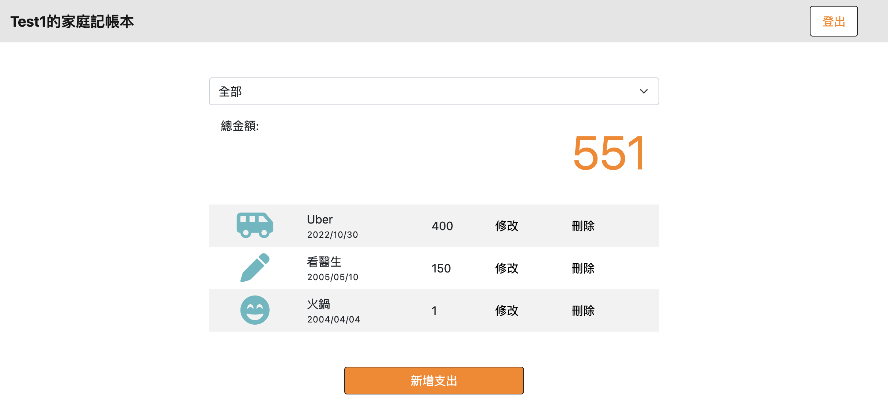
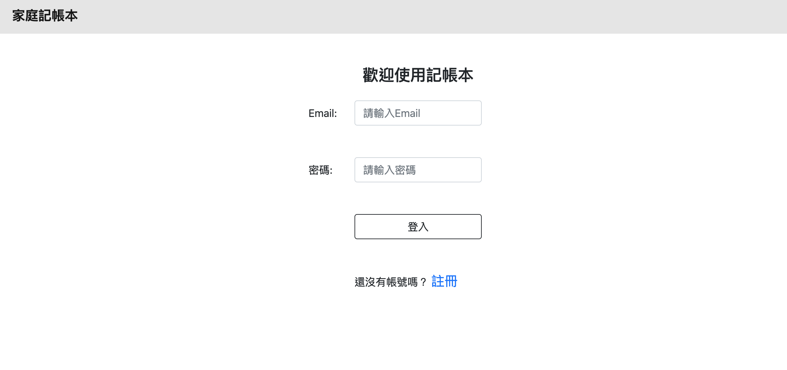

# Expense Tracker




## Introduction

An expense tracker built by Node.js, Express and MongoDB

## Features
* Users can register an account to create their own expense records
* Users can see all records on home page
* Users can filter records by category

## Environment Setup
Please install Node.js and npm before starting; make sure you already have a MongoDB account

## How to Use

1. Clone the project to local side
2. Access the project directory through terminal, then type in:

   ```bash
   npm install
   ```

3. Once installed, create a **.env** file in project folder to set environment variables. You can find example in **.env.example**.
   * **GOOGLE_CLIENT_ID** and **GOOGLE_CLIENT_SECRET** should be your Google App ID and App secret. Create your app in [Google Developers Console](https://console.developers.google.com/)
   * **MONGODB_URI** should be your MongoDB connection string.

4. Then type in :

   ```bash
   npm run seed
   ```

5. You'll see below messages in console once finished.

    ```bash
    mongodb connected
    seed category constructed
    mongodb connected
    seed record constructed
    ```

6. Then type in:

   ```bash
   npm run start
   ```

7. You'll see below message in console; open your browser and enter URL.

   ```bash
   Expense Tracker is running on http://localhost:3000
   ```

8. Now you can use below test accounts or create your own accounts to record expenses.
   * email: test1@test.com, pwd: test
   * email: test2@test.com, pwd: test

9. To stop the server:

   ```bash
   ctrl + c
   ```


